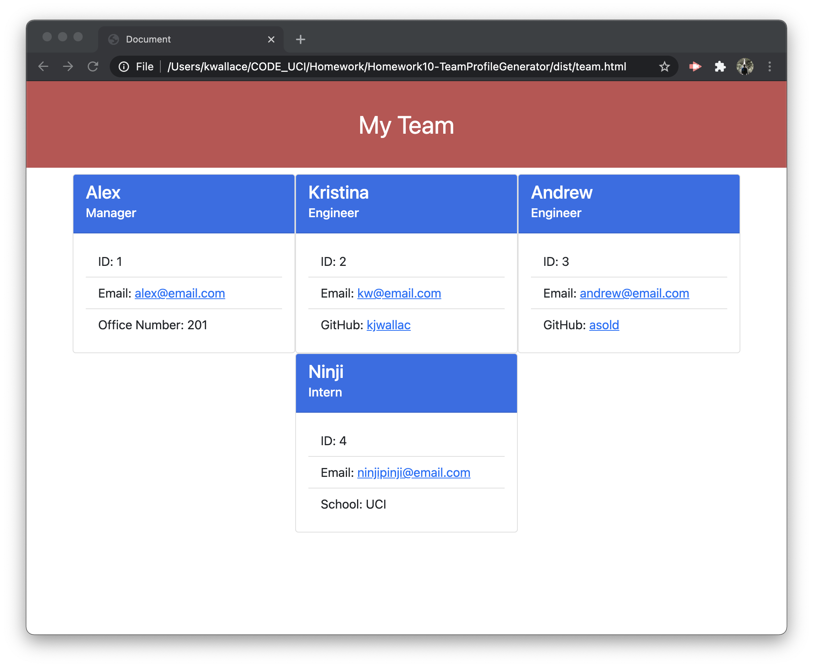

# Homework10-TeamProfileGenerator
Repository for Homework 10 - Team Profile Generator

## User Story
AS A manager  
I WANT to generate a webpage that displays my team's basic info  
SO THAT I have quick access to their emails and GitHub profiles  

## Application criteria / Instructions
Using a command-line application that accepts user input  
WHEN the user is prompted for their team members and theif information  
THEN an HTML file is generated that displays a nicely formatted team roster based on user input  
WHEN the user clicks on an email address in the HTML  
THEN the default email program opens andpopulates the TO field of hteemail with the address  
WHEN the user clicks on the GitHub username  
THEN that GitHub profile opens in a new tab  
WHEN the user starts the application  
THEN the user is prompted to choose the type of employee to add  
THEN the user is prompted to enter the employee's name, employee ID, and email address  
THEN depending on the role chosen, the use is prompted to enter one of the following:  
   - Manager - room number  
   - Engineer - HitHub username  
   - Intern - School name  
  
THEN the user is questioned whether to add another record  
   - If YES, the user is again prompted what type of employee to add  
   - If NO, the application exists and the HTML is generated  

[Team Profile Generator Screencast](https://drive.google.com/file/d/1Jj98blu_KdbFevZwWGWqtZ6haaMOYG2_/view)

